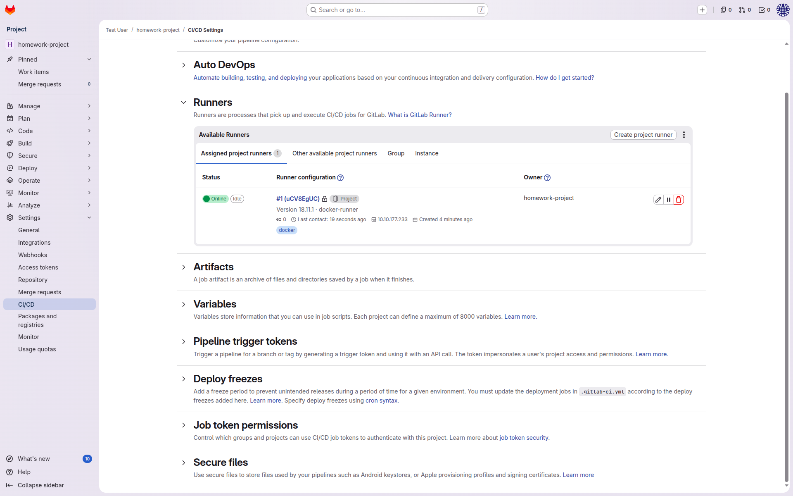
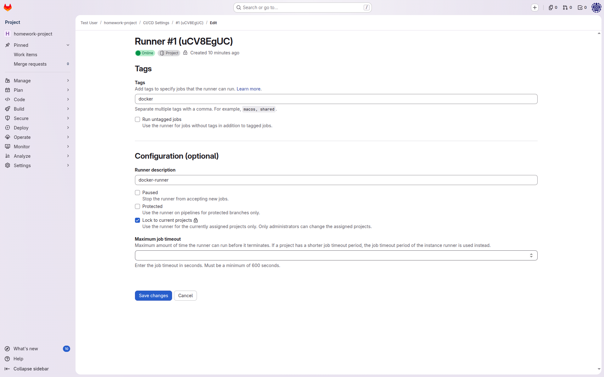
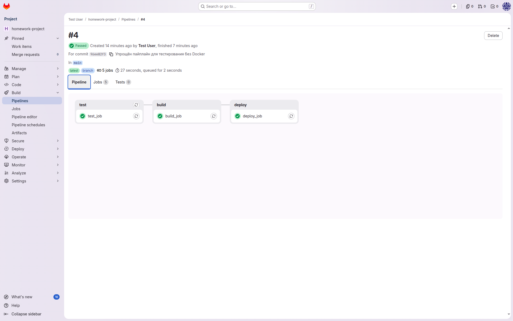
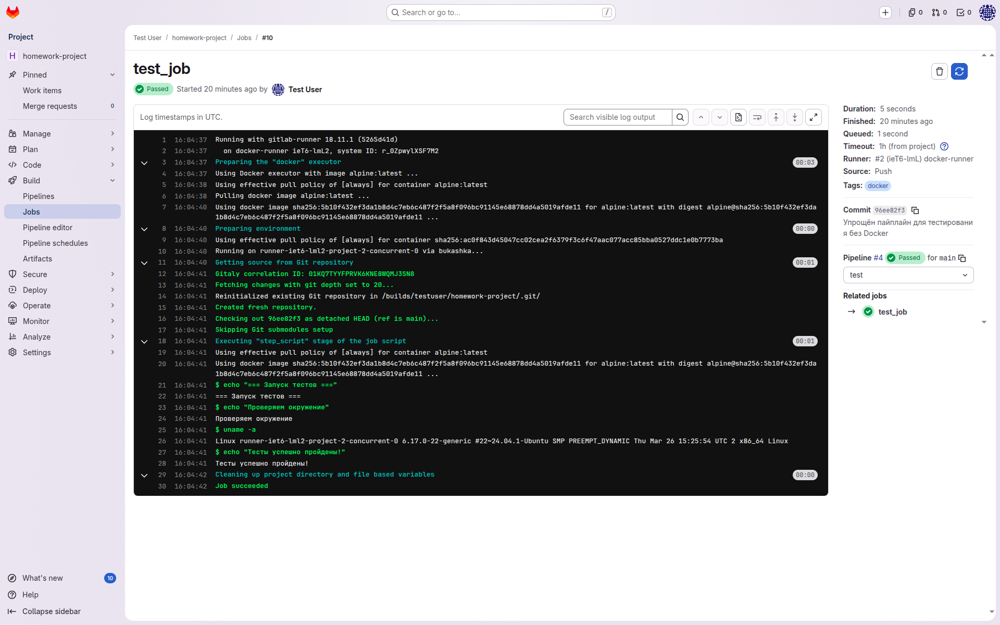
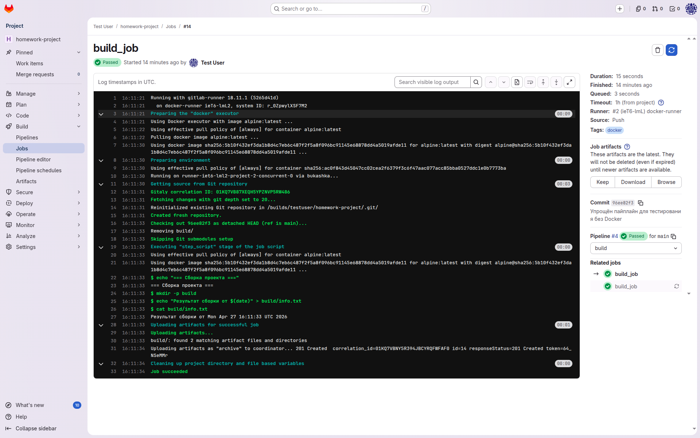
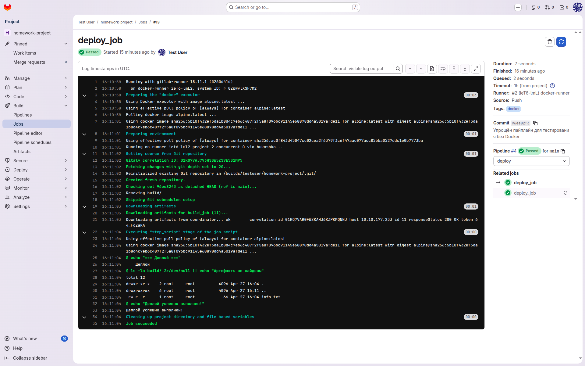

# Домашнее задание к занятию GitLab CI/CD
**Марина Кукушкина**

## Задание 1: Развертывание GitLab и настройка runner

### Скриншот 1: Настройки Runners

### Скриншот 2: Детали конфигурации раннера

## Задание 2: CI/CD пайплайн

### Файл .gitlab-ci.yml

yaml
stages:
  - test
  - build
  - deploy

test_job:
  stage: test
  image: alpine:latest
  tags:
    - docker
  script:
    - echo "=== Запуск тестов ==="
    - echo "Тесты успешно пройдены!"

build_job:
  stage: build
  image: alpine:latest
  tags:
    - docker
  script:
    - echo "=== Сборка проекта ==="
    - mkdir -p build
    - echo "Результат сборки" > build/info.txt
  artifacts:
    paths:
      - build/

deploy_job:
  stage: deploy
  image: alpine:latest
  tags:
    - docker
  script:
    - echo "=== Деплой ==="
    - echo "Деплой успешно выполнен!"
  only:
    - main

### Скриншоты успешных сборок

